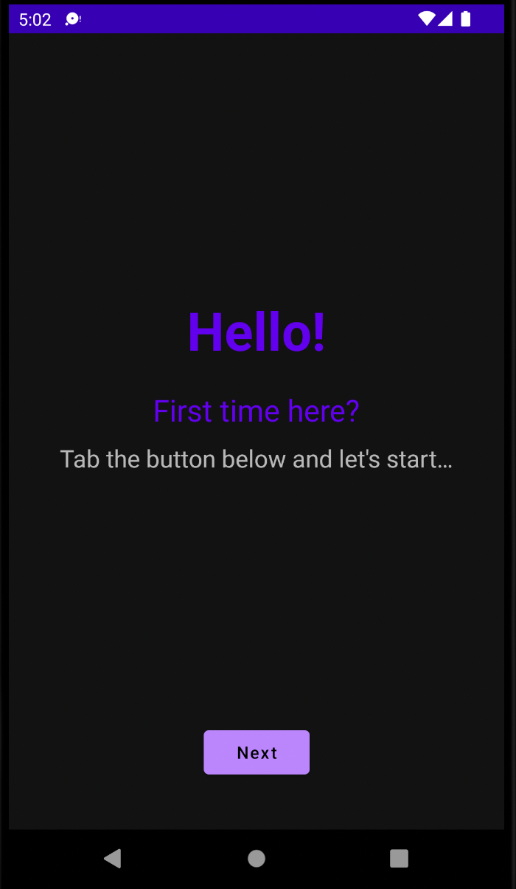
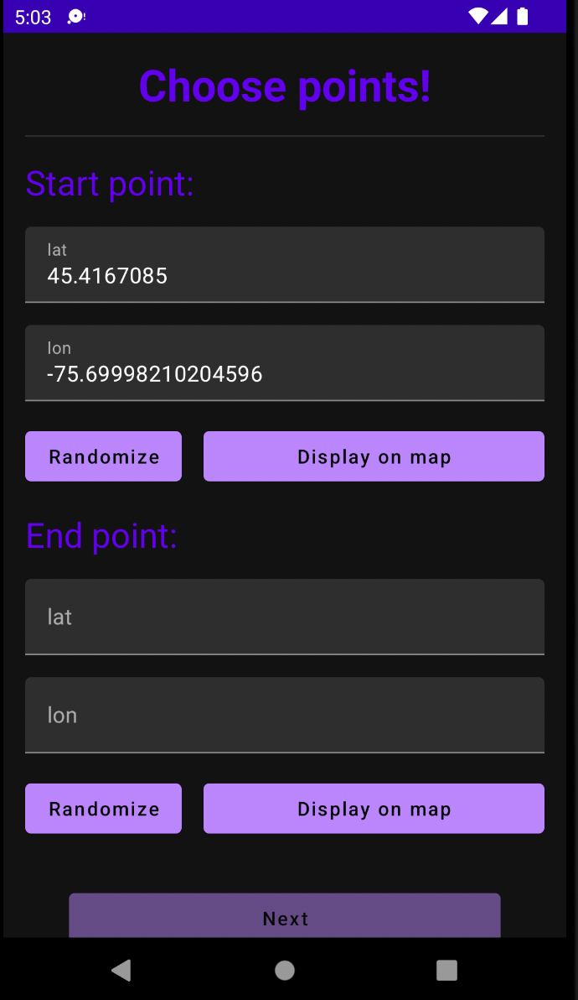
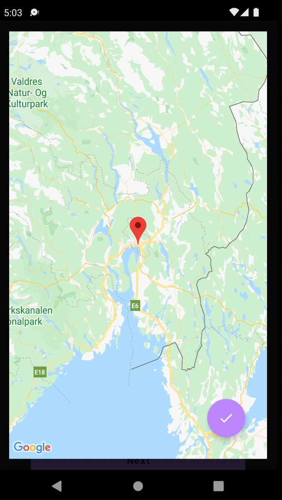
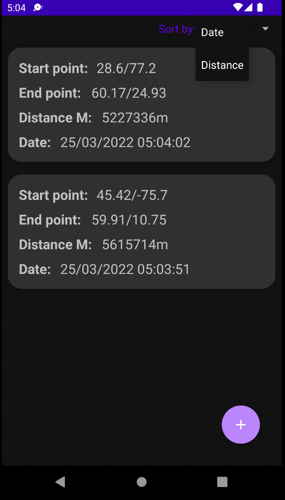
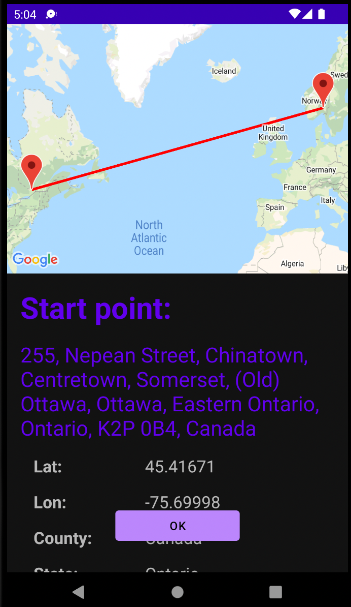

# Demo distance calculator
### Demo project, provides user to calculate distance between 2 world coordinates
[DOWNLOAD APK](gitRes/demo_distance_calculator_app_debug.apk)

## Hello screen
You can see it when you open app first time

## Choosing points screen
Here you can select 2 world point, screen provide 2 options of choosing "Random" (from hardcoded list) and self-map-pick

## List screen
Here you can see list of distances info, sort them by date or distance or check detail information by tapping on it

## Detail screen
Contains map snapshot and some additional data

